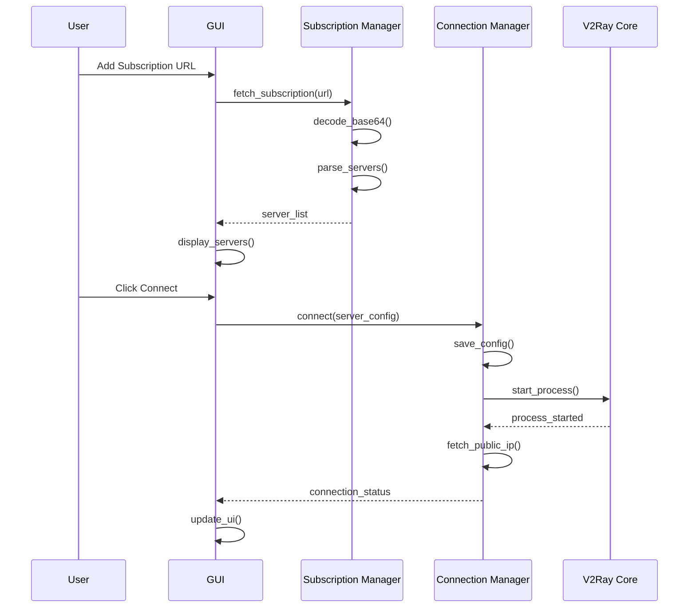

# Design Document

## Overview

The Ubuntu V2Ray Client is a PyQt6-based desktop application that provides a modern, user-friendly interface for managing V2Ray VPN connections. The application follows a modular architecture with clear separation between GUI, business logic, and system integration layers.

The system consists of four main components:
1. **GUI Layer** - PyQt6 interface with tabs, themes, and animations
2. **Connection Management** - V2Ray process lifecycle and configuration
3. **Subscription Management** - Fetching, parsing, and updating server lists
4. **Testing Framework** - Comprehensive automated tests for all components

## Architecture

### High-Level Architecture

```
┌─────────────────────────────────────────────────────────┐
│                     GUI Layer (PyQt6)                    │
│  ┌──────────┐  ┌──────────┐  ┌──────────┐              │
│  │ Servers  │  │ Settings │  │   Logs   │              │
│  │   Tab    │  │   Tab    │  │   Tab    │              │
│  └──────────┘  └──────────┘  └──────────┘              │
└─────────────────────────────────────────────────────────┘
                         │
                         ▼
┌─────────────────────────────────────────────────────────┐
│                  Business Logic Layer                    │
│  ┌──────────────┐  ┌──────────────┐  ┌──────────────┐  │
│  │  Connection  │  │ Subscription │  │    Server    │  │
│  │   Manager    │  │   Manager    │  │   Updater    │  │
│  └──────────────┘  └──────────────┘  └──────────────┘  │
└─────────────────────────────────────────────────────────┘
                         │
                         ▼
┌─────────────────────────────────────────────────────────┐
│                  System Integration Layer                │
│  ┌──────────────┐  ┌──────────────┐  ┌──────────────┐  │
│  │   V2Ray      │  │   Network    │  │     File     │  │
│  │   Process    │  │   Requests   │  │   System     │  │
│  └──────────────┘  └──────────────┘  └──────────────┘  │
└─────────────────────────────────────────────────────────┘
```

### Component Interaction Flow



## Components and Interfaces

### 1. Main Window (main.py)

**Purpose:** Entry point and main window controller

**Key Classes:**
- `MainWindow(QMainWindow)` - Main application window

**Responsibilities:**
- Initialize PyQt6 application
- Create and manage tab widget
- Load and apply themes
- Handle window events and lifecycle

**Interface:**
```python
class MainWindow(QMainWindow):
    def __init__(self):
        """Initialize main window with tabs and theme"""
        
    def load_theme(self, theme_name: str) -> None:
        """Load CSS theme file and apply to application"""
        
    def show_toast(self, message: str, type: str) -> None:
        """Display floating toast notification"""
        
    def closeEvent(self, event: QCloseEvent) -> None:
        """Handle cleanup on window close"""
```

### 2. Connection Manager (v2_manager.py)

**Purpose:** Manage V2Ray process lifecycle and connection state

**Key Classes:**
- `V2RayManager` - Handles V2Ray process operations

**Responsibilities:**
- Start/stop V2Ray Core process
- Manage configuration files
- Monitor process status
- Fetch public IP information
- Stream process logs

**Interface:**
```python
class V2RayManager:
    def __init__(self, config_dir: str = "~/.config/v2ray-client"):
        """Initialize manager with configuration directory"""
        
    def connect(self, server_config: dict) -> bool:
        """
        Start V2Ray with given configuration
        Returns: True if connection successful
        """
        
    def disconnect(self) -> bool:
        """
        Stop V2Ray process and cleanup
        Returns: True if disconnection successful
        """
        
    def is_connected(self) -> bool:
        """Check if V2Ray process is running"""
        
    def get_public_ip(self) -> dict:
        """
        Fetch public IP info from ipinfo.io
        Returns: {"ip": "1.2.3.4", "country": "US", "city": "New York"}
        """
        
    def get_logs(self) -> str:
        """Get recent V2Ray process logs"""
        
    def stream_logs(self, callback: callable) -> None:
        """Stream logs to callback function in real-time"""
```

**Implementation Details:**
- Use `subprocess.Popen` to start V2Ray with `v2ray -config <path>`
- Store process handle for lifecycle management
- Use `threading` for non-blocking log streaming
- Configuration saved to `~/.config/v2ray-client/temp_config.json`
- Process terminated with `SIGTERM` for clean shutdown

### 3. Subscription Manager (subscription_manager.py)

**Purpose:** Fetch and parse server lists from subscription URLs

**Key Classes:**
- `SubscriptionManager` - Handles subscription operations
- `ServerParser` - Parses different server formats

**Responsibilities:**
- Fetch content from URLs
- Decode Base64 encoded data
- Parse vmess://, vless://, trojan:// links
- Parse JSON server configurations
- Merge and deduplicate servers

**Interface:**
```python
class SubscriptionManager:
    def __init__(self):
        """Initialize subscription manager"""
        
    def add_subscription(self, url: str, name: str = "") -> bool:
        """Add new subscription URL"""
        
    def remove_subscription(self, url: str) -> bool:
        """Remove subscription URL"""
        
    def fetch_subscription(self, url: str) -> list[dict]:
        """
        Fetch and parse servers from URL
        Returns: List of server configuration dictionaries
        """
        
    def fetch_all_subscriptions(self) -> list[dict]:
        """Fetch all subscriptions and merge servers"""
        
    def get_subscriptions(self) -> list[dict]:
        """Get list of configured subscriptions"""

class ServerParser:
    @staticmethod
    def parse_vmess(link: str) -> dict:
        """Parse vmess:// link to configuration dict"""
        
    @staticmethod
    def parse_vless(link: str) -> dict:
        """Parse vless:// link to configuration dict"""
        
    @staticmethod
    def parse_trojan(link: str) -> dict:
        """Parse trojan:// link to configuration dict"""
        
    @staticmethod
    def decode_base64(content: str) -> str:
        """Decode Base64 content"""
        
    @staticmethod
    def deduplicate_servers(servers: list[dict]) -> list[dict]:
        """Remove duplicate servers based on IP and port"""
```

**Implementation Details:**
- Use `requests` library for HTTP fetching with 10-second timeout
- Support both plain text and Base64 encoded subscription content
- Parse vmess:// links by Base64 decoding and JSON parsing
- Parse vless:// and trojan:// links using URL parsing
- Deduplicate based on unique combination of (protocol, ip, port, uuid)
- Store subscriptions in `~/.config/v2ray-client/subscriptions.json`

### 4. Server Updater (server_updater.py)

**Purpose:** Periodically refresh server lists and update GUI

**Key Classes:**
- `ServerUpdater` - Background updater with timer

**Responsibilities:**
- Schedule periodic subscription updates
- Ping servers to measure latency
- Sort servers by ping or name
- Notify GUI of updates

**Interface:**
```python
class ServerUpdater:
    def __init__(self, subscription_manager: SubscriptionManager, 
                 interval: int = 10):
        """Initialize updater with refresh interval in seconds"""
        
    def start(self) -> None:
        """Start periodic updates"""
        
    def stop(self) -> None:
        """Stop periodic updates"""
        
    def set_interval(self, seconds: int) -> None:
        """Change refresh interval"""
        
    def refresh_now(self) -> None:
        """Trigger immediate refresh"""
        
    def ping_server(self, ip: str, port: int) -> int:
        """
        Measure ping latency to server
        Returns: Latency in milliseconds, -1 if unreachable
        """
        
    def sort_servers(self, servers: list[dict], 
                     by: str = "ping") -> list[dict]:
        """Sort servers by 'ping' or 'name'"""
```

**Implementation Details:**
- Use `QTimer` for periodic updates to integrate with Qt event loop
- Use `socket` with timeout for TCP ping measurement
- Ping measurement: connect to server port and measure time
- Update servers in background thread to avoid blocking GUI
- Emit Qt signals to notify GUI of updates

### 5. GUI Components

#### Servers Tab (ui/servers_tab.py)

**Purpose:** Display server list with connection controls

**Key Classes:**
- `ServersTab(QWidget)` - Main servers tab widget
- `ServerCard(QWidget)` - Individual server display card

**Responsibilities:**
- Display server cards in scrollable grid
- Show server details (name, flag, IP, ping)
- Handle connect/disconnect button clicks
- Display connection status

**Interface:**
```python
class ServersTab(QWidget):
    connection_requested = pyqtSignal(dict)  # Emits server config
    disconnection_requested = pyqtSignal()
    
    def __init__(self, v2ray_manager: V2RayManager):
        """Initialize servers tab"""
        
    def update_servers(self, servers: list[dict]) -> None:
        """Refresh server list display"""
        
    def set_connection_status(self, connected: bool, 
                             server_name: str = "") -> None:
        """Update connection status display"""

class ServerCard(QWidget):
    connect_clicked = pyqtSignal(dict)
    
    def __init__(self, server: dict):
        """Initialize server card with server data"""
        
    def update_ping(self, ping_ms: int) -> None:
        """Update ping display"""
        
    def set_connected(self, connected: bool) -> None:
        """Update visual state for connection"""
```

**Layout:**
```
┌─────────────────────────────────────────┐
│  🔍 Search: [____________]  🔁 Refresh  │
├─────────────────────────────────────────┤
│ ┌──────────┐ ┌──────────┐ ┌──────────┐ │
│ │ 🇺🇸 USA-1 │ │ 🇸🇬 SG-2  │ │ 🇩🇪 DE-3  │ │
│ │ 45.67.89 │ │ 103.145  │ │ 88.99.10 │ │
│ │ ████░░░  │ │ ██░░░░░  │ │ █████░░  │ │
│ │ 92ms     │ │ 45ms     │ │ 120ms    │ │
│ │ [Connect]│ │ [Connect]│ │ [Connect]│ │
│ └──────────┘ └──────────┘ └──────────┘ │
└─────────────────────────────────────────┘
```

#### Settings Tab (ui/settings_tab.py)

**Purpose:** Configure application settings

**Key Classes:**
- `SettingsTab(QWidget)` - Settings interface

**Responsibilities:**
- Manage subscription URLs
- Configure refresh interval
- Select theme
- Toggle auto-start

**Interface:**
```python
class SettingsTab(QWidget):
    theme_changed = pyqtSignal(str)
    interval_changed = pyqtSignal(int)
    
    def __init__(self, subscription_manager: SubscriptionManager):
        """Initialize settings tab"""
        
    def add_subscription_dialog(self) -> None:
        """Show dialog to add new subscription"""
        
    def remove_subscription(self, url: str) -> None:
        """Remove subscription from list"""
        
    def save_settings(self) -> None:
        """Persist settings to disk"""
        
    def load_settings(self) -> None:
        """Load settings from disk"""
```

**Layout:**
```
┌─────────────────────────────────────────┐
│ Subscriptions                           │
│ ┌─────────────────────────────────────┐ │
│ │ https://github.com/...  [Edit] [X] │ │
│ │ https://raw.github...   [Edit] [X] │ │
│ └─────────────────────────────────────┘ │
│ [+ Add Subscription]                    │
│                                         │
│ Refresh Interval: [10] seconds          │
│                                         │
│ Theme: ○ Light ● Dark ○ Neon           │
│                                         │
│ ☐ Auto-start on login                  │
│                                         │
│ [Save Settings]                         │
└─────────────────────────────────────────┘
```

#### Logs Tab (ui/logs_tab.py)

**Purpose:** Display live V2Ray logs

**Key Classes:**
- `LogsTab(QWidget)` - Logs display widget

**Responsibilities:**
- Stream V2Ray process output
- Auto-scroll to latest logs
- Provide clear/export functions

**Interface:**
```python
class LogsTab(QWidget):
    def __init__(self, v2ray_manager: V2RayManager):
        """Initialize logs tab"""
        
    def append_log(self, text: str) -> None:
        """Add log line to display"""
        
    def clear_logs(self) -> None:
        """Clear all logs"""
        
    def export_logs(self, filepath: str) -> None:
        """Export logs to file"""
```

### 6. Theme System (ui/themes/)

**Purpose:** Provide visual customization

**Theme Files:**
- `dark.qss` - Dark theme stylesheet
- `light.qss` - Light theme stylesheet
- `neon.qss` - Neon theme with gradients

**Theme Structure:**
```css
/* Neon Theme Example */
QMainWindow {
    background: qlineargradient(
        x1:0, y1:0, x2:1, y2:1,
        stop:0 #1a1a2e, stop:1 #16213e
    );
}

QPushButton {
    background: qlineargradient(
        x1:0, y1:0, x2:1, y2:0,
        stop:0 #6a11cb, stop:1 #2575fc
    );
    border-radius: 8px;
    padding: 10px;
    color: white;
    font-weight: bold;
}

QPushButton:hover {
    background: qlineargradient(
        x1:0, y1:0, x2:1, y2:0,
        stop:0 #7b1fdb, stop:1 #3685ff
    );
    box-shadow: 0 0 20px rgba(37, 117, 252, 0.6);
}

/* Server Card Styling */
.ServerCard {
    background: rgba(255, 255, 255, 0.05);
    border: 1px solid rgba(255, 255, 255, 0.1);
    border-radius: 12px;
    padding: 15px;
}
```

## Data Models

### Server Configuration

```python
{
    "name": str,           # Display name (e.g., "Singapore 🇸🇬")
    "type": str,           # Protocol: "vmess", "vless", "trojan"
    "ip": str,             # Server IP address
    "port": int,           # Server port
    "uuid": str,           # User ID
    "alterId": int,        # Alter ID (vmess only)
    "security": str,       # Encryption: "auto", "aes-128-gcm", etc.
    "network": str,        # Network type: "tcp", "ws", "grpc"
    "tls": bool,           # TLS enabled
    "sni": str,            # Server name indication
    "path": str,           # WebSocket path (if network=ws)
    "ping": int,           # Latency in ms (-1 if unknown)
    "country_code": str    # ISO country code for flag
}
```

### Subscription Data

```python
{
    "url": str,            # Subscription URL
    "name": str,           # User-defined name
    "last_update": str,    # ISO timestamp
    "server_count": int,   # Number of servers
    "enabled": bool        # Active status
}
```

### Application Settings

```python
{
    "theme": str,                    # "dark", "light", "neon"
    "refresh_interval": int,         # Seconds
    "auto_start": bool,              # Launch on login
    "sort_by": str,                  # "ping" or "name"
    "subscriptions": list[dict],     # List of subscription objects
    "last_connected_server": dict    # Last used server config
}
```

## Error Handling

### Connection Errors

**Scenarios:**
1. V2Ray Core not installed
2. Invalid server configuration
3. Network unreachable
4. Process start failure

**Handling:**
```python
class ConnectionError(Exception):
    """Base class for connection errors"""
    
class V2RayCoreNotFoundError(ConnectionError):
    """V2Ray binary not found in PATH"""
    
class InvalidConfigError(ConnectionError):
    """Server configuration is invalid"""
    
class NetworkUnreachableError(ConnectionError):
    """Cannot reach server"""
```

**User Feedback:**
- Display error toast with specific message
- Log detailed error to Logs tab
- Suggest remediation steps in error message

### Subscription Errors

**Scenarios:**
1. URL unreachable
2. Invalid format
3. Decode failure
4. Empty subscription

**Handling:**
- Log error but continue with other subscriptions
- Display warning toast
- Mark subscription as failed in UI
- Retry on next refresh cycle

### GUI Errors

**Scenarios:**
1. Theme file not found
2. Icon missing
3. Invalid settings file

**Handling:**
- Fall back to default theme
- Use placeholder icons
- Reset to default settings
- Log warnings to console

## Testing Strategy

### 1. Unit Tests

**test_v2_manager.py:**
```python
def test_connect_creates_config_file()
def test_connect_starts_process()
def test_disconnect_kills_process()
def test_disconnect_removes_config()
def test_get_public_ip_returns_valid_data()
def test_is_connected_returns_correct_status()
```

**test_subscription_manager.py:**
```python
def test_fetch_subscription_decodes_base64()
def test_parse_vmess_link()
def test_parse_vless_link()
def test_deduplicate_servers()
def test_merge_multiple_subscriptions()
def test_handle_invalid_url()
```

**test_server_updater.py:**
```python
def test_ping_server_returns_latency()
def test_sort_servers_by_ping()
def test_periodic_refresh_triggers()
def test_refresh_interval_change()
```

### 2. Integration Tests

**test_gui.py:**
```python
def test_main_window_launches()
def test_all_tabs_accessible()
def test_connect_button_triggers_connection()
def test_disconnect_button_triggers_disconnection()
def test_theme_change_applies()
def test_subscription_add_updates_server_list()
def test_logs_display_v2ray_output()
```

### 3. Network Tests

**test_network.py:**
```python
def test_fetch_real_subscription_url()  # Uses test URL
def test_ipinfo_api_reachable()
def test_ping_measurement_accuracy()
def test_handle_network_timeout()
```

### 4. Mock Strategy

**Mocking V2Ray Process:**
```python
# Use mock subprocess for testing without V2Ray installed
@patch('subprocess.Popen')
def test_connect(mock_popen):
    mock_process = MagicMock()
    mock_process.poll.return_value = None  # Running
    mock_popen.return_value = mock_process
    
    manager = V2RayManager()
    result = manager.connect(test_config)
    
    assert result == True
    mock_popen.assert_called_once()
```

**Mocking Network Requests:**
```python
@patch('requests.get')
def test_fetch_subscription(mock_get):
    mock_response = MagicMock()
    mock_response.text = base64.b64encode(test_servers.encode())
    mock_get.return_value = mock_response
    
    manager = SubscriptionManager()
    servers = manager.fetch_subscription("http://test.url")
    
    assert len(servers) > 0
```

### 5. Test Execution

**Run all tests:**
```bash
pytest tests/ -v
```

**Run with coverage:**
```bash
pytest tests/ --cov=. --cov-report=html
```

**Expected output:**
```
tests/test_gui.py::test_main_window_launches PASSED
tests/test_gui.py::test_all_tabs_accessible PASSED
tests/test_v2_manager.py::test_connect_starts_process PASSED
tests/test_v2_manager.py::test_disconnect_kills_process PASSED
tests/test_subscription_manager.py::test_parse_vmess_link PASSED
tests/test_network.py::test_ping_measurement PASSED

==================== 14 passed in 6.3s ====================
```

## Performance Considerations

### GUI Responsiveness

- Run network operations in background threads using `QThread`
- Use `QTimer` for periodic updates to avoid blocking
- Limit server list to 100 cards per page with pagination
- Cache country flag images to avoid repeated loading

### Memory Management

- Limit log buffer to 10,000 lines
- Clear old logs when limit reached
- Release server card widgets when scrolled out of view
- Use weak references for callback handlers

### Network Efficiency

- Batch ping measurements (max 5 concurrent)
- Cache subscription content for 10 seconds
- Use HTTP compression for subscription fetches
- Implement exponential backoff for failed requests

## Security Considerations

### Configuration Storage

- Store configurations in user home directory with 0600 permissions
- Never log sensitive data (UUIDs, passwords)
- Clear temporary config file on disconnect
- Validate all user input before processing

### Network Security

- Use HTTPS for subscription URLs when possible
- Validate SSL certificates
- Sanitize URLs before fetching
- Limit subscription file size to 10MB

### Process Security

- Run V2Ray process with user privileges (not root)
- Validate V2Ray binary path before execution
- Use absolute paths for all file operations
- Implement timeout for process operations

## Deployment

### Package Structure

**.deb package:**
```
v2ray-client_1.0.0_amd64.deb
├── usr/
│   ├── bin/
│   │   └── v2ray-client
│   ├── share/
│   │   ├── applications/
│   │   │   └── v2ray-client.desktop
│   │   └── icons/
│   │       └── v2ray-client.png
│   └── lib/
│       └── v2ray-client/
│           ├── main.py
│           ├── v2_manager.py
│           ├── subscription_manager.py
│           └── ui/
└── DEBIAN/
    ├── control
    ├── postinst
    └── prerm
```

**.AppImage structure:**
```
V2RayClient-1.0.0-x86_64.AppImage
├── AppRun
├── v2ray-client.desktop
├── v2ray-client.png
└── usr/
    ├── bin/python3
    ├── lib/python3.10/
    └── share/v2ray-client/
```

### Installation Script

The `install.sh` script will:
1. Check for Ubuntu 20.04+
2. Install system dependencies (python3, pip, curl)
3. Install V2Ray Core using official script
4. Install Python packages (PyQt6, requests, pytest)
5. Create config directory structure
6. Set appropriate permissions
7. Optionally create desktop entry

### Desktop Integration

**v2ray-client.desktop:**
```ini
[Desktop Entry]
Name=V2Ray Client
Comment=Modern V2Ray VPN Client
Exec=v2ray-client
Icon=v2ray-client
Terminal=false
Type=Application
Categories=Network;VPN;
```

## Future Enhancements

1. **Protocol Support:** Add support for Shadowsocks, Hysteria
2. **Routing Rules:** Custom routing based on domain/IP
3. **Statistics:** Bandwidth usage graphs and history
4. **Profiles:** Save multiple connection profiles
5. **System Tray:** Minimize to tray with quick connect menu
6. **Auto-Connect:** Connect to fastest server on startup
7. **Backup/Restore:** Export/import configuration
8. **Multi-Language:** i18n support for different languages
